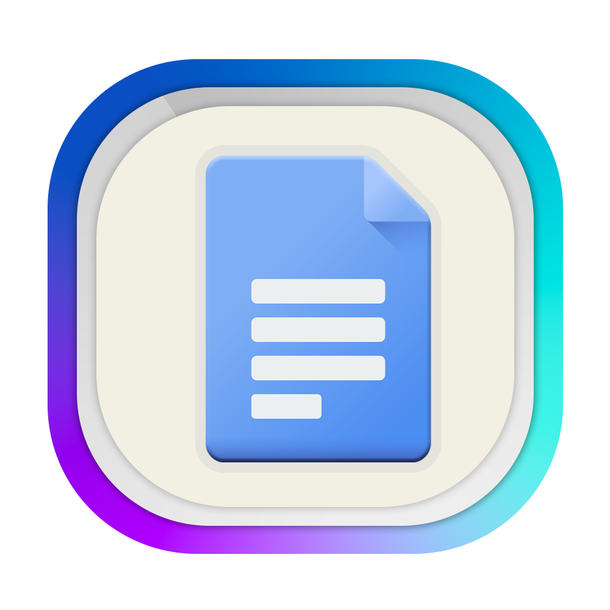
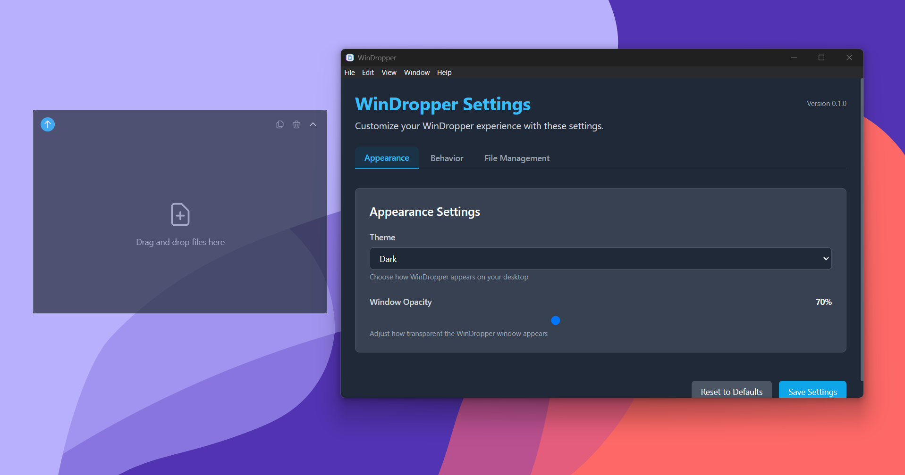

<p align="center">
  
</p>

<h1 align="center">WinDropper</h1>

<p align="center">
WinDropper is a Windows alternative to macOS Dropover, providing a convenient way to temporarily store files for easy organization and movement across different locations.
</p>

<p align="center">
  
</p>

## Features

- **Drag and Drop File Stacking:** Easily drag files from File Explorer to the floating notch
- **Multi-File Management:** Select and drag multiple files at once using checkboxes
- **Smart File Organization:** Categorize files by type when moving them to destinations
- **Floating Notch UI:** Minimalistic, resizable, and always-on-top window for quick access
- **Context Menu Actions:** Quick actions for files including copying paths, opening containing folders
- **Keyboard Shortcuts:** Use CTRL+SHIFT+D to show/hide the WinDropper notch
- **Customization:** Change appearance, behavior, and file management settings
- **Dark/Light Mode Support:** Adapts to your system theme or manually selectable
- **Start on Boot:** Option to automatically launch when you log in to Windows

## Installation

### Latest Release

You can download the latest release from the [Releases](https://github.com/username/windropper/releases) page. For the current beta, we provide two options:

#### Method 1: Installer (Recommended)

1. Download the "WinDropper Setup 0.1.0-beta.1.exe" installer from the releases page
2. Run the installer and follow the prompts
3. Launch WinDropper from your Start menu

#### Method 2: Portable Version

1. Download "WinDropper-0.1.0-beta.1-portable.zip" from the releases page
2. Extract the ZIP to a location of your choice
3. Run `WinDropper.exe` to start the application

## Usage

### Basic Usage

1. **Start WinDropper:** Run the application from the Start menu or taskbar
2. **Show/Hide the Notch:** Press `CTRL+SHIFT+D` to toggle the floating notch
3. **Drag Files:** Drag any files from File Explorer to the floating notch
4. **Select Multiple Files:** Use the checkboxes to select files, then drag them as a group
5. **Use Context Menu:** Right-click on files or the notch for more options
6. **Move Files:** Drag files back out to a new location or use the context menu to move them to predefined locations

### Tips & Tricks

- **Quick Copy Paths:** Select files and click the copy button or use the context menu
- **Custom Destinations:** Set your preferred default destination in Settings
- **Organize Automatically:** Enable "Organize files by type" to sort files into folders
- **Move to Recent Locations:** Right-click and use the "Move to" menu to access recent destinations
- **Start on Boot:** Enable in Settings to have WinDropper ready when you need it

## Development

WinDropper is an Electron application built with React, TypeScript, and TailwindCSS.

### Setup Development Environment

1. Clone the repository:

```bash
git clone https://github.com/username/windropper.git
cd windropper
```

2. Install dependencies:

```bash
npm install
```

3. Run in development mode:

```bash
# Use the enhanced development environment
npm run dev

# Or use the simplified batch file on Windows
dev.bat
```

The enhanced development environment provides:

- Automatic TypeScript compilation
- Vite development server for the renderer
- Automatic Electron startup when the server is ready
- Interactive command interface:
  - `restart` or `r` - Restart the Electron process
  - `quit` or `q` - Exit the development environment
  - `help` or `h` - Show available commands

### Building

To build the application for distribution:

```bash
# Build the application
npm run build

# Package for distribution
npm run package
```

The packaged application will be available in the `release` folder.

## Contributing

Contributions are welcome! Please feel free to submit a Pull Request.

1. Fork the repository
2. Create your feature branch (`git checkout -b feature/amazing-feature`)
3. Commit your changes (`git commit -m 'Add some amazing feature'`)
4. Push to the branch (`git push origin feature/amazing-feature`)
5. Open a Pull Request

## License

This project is licensed under the MIT License - see the LICENSE file for details.

## Acknowledgments

- Inspired by macOS Dropover
- Built with Electron, React, TypeScript, and TailwindCSS
